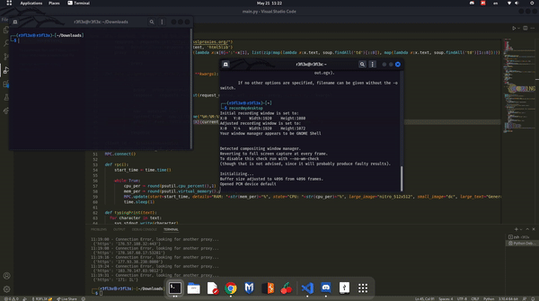

# Nitro Generator and Checker
A powerfull script that generates nitro codes for Discord and checks if they work


# How to run

Windows
```py
pip install -r requirements.txt
Run the .exe
```

Linux
```py
cd your_directory
pip3 install requirements.txt
chmod +x Nitro-Generator-N-Checker
./Nitro-Generator-N-Checker
```

**WORKS ONLY WITH PYTHON 3.5 AND ABOVE**

# Showcase



## Modules used

>- os
>- requests
>- random
>- sys
>- string
>- time
>- colorama
>- psutil
>- threading
>- pypresence
>- bs4
>- datetime

### Do you want to contribute?
> DM me on Discord! (R3FL3X#1337)
